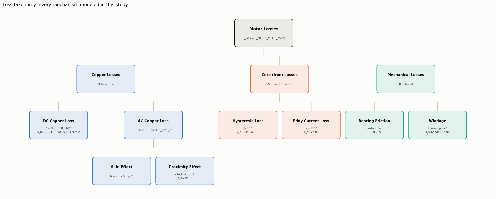
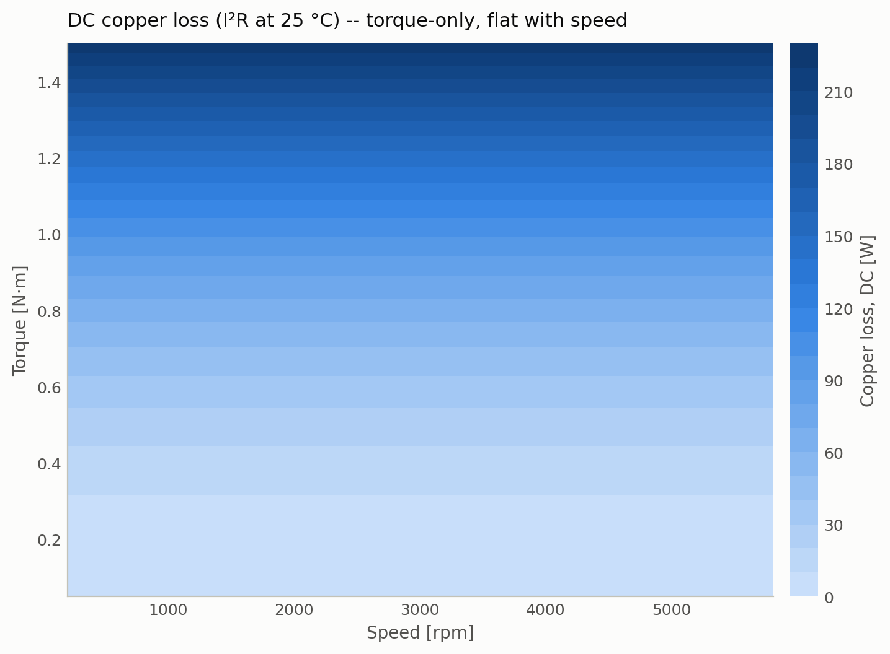
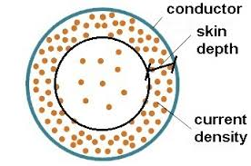
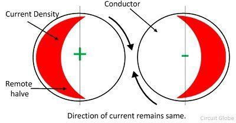
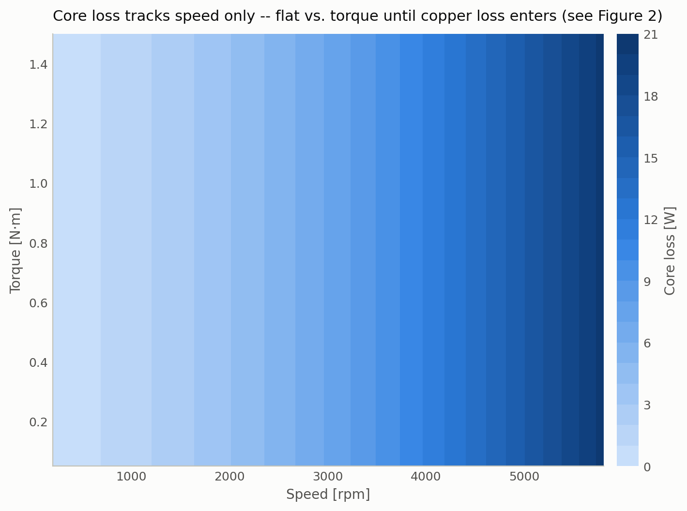
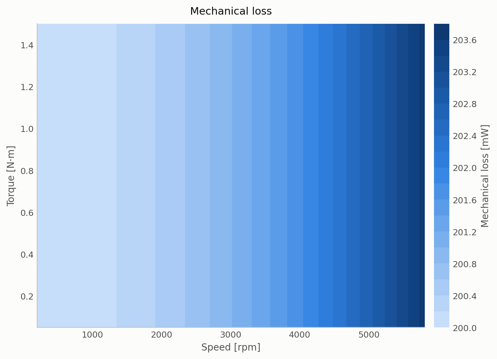
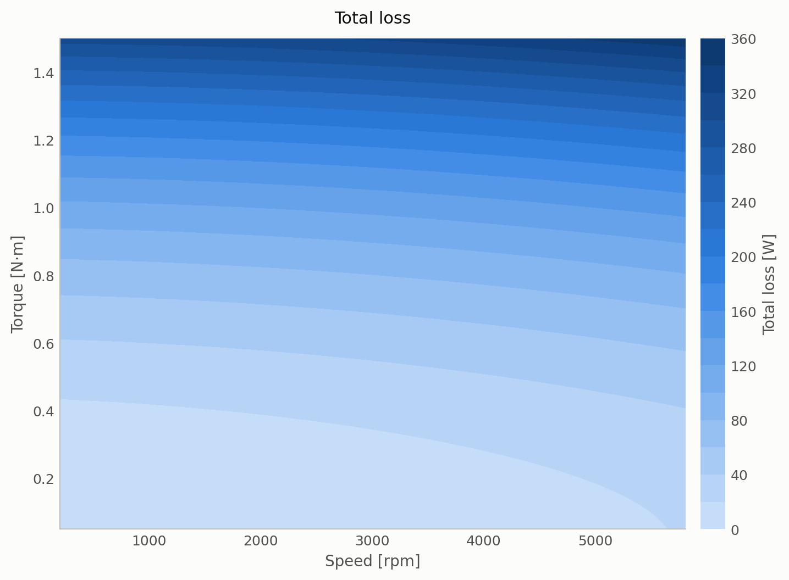
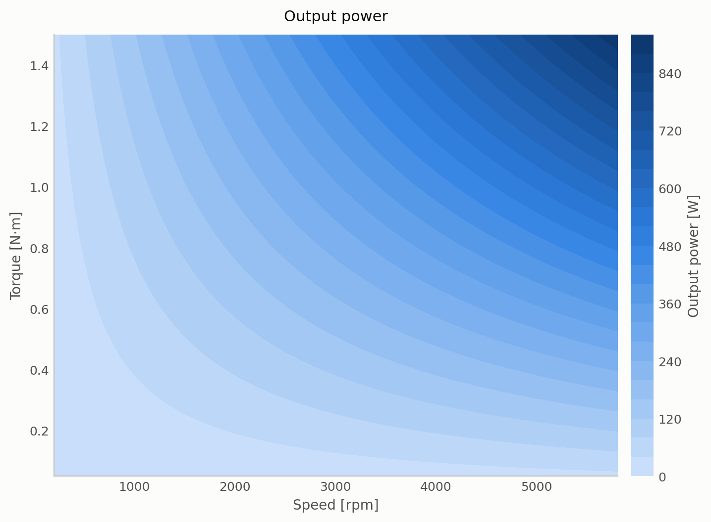
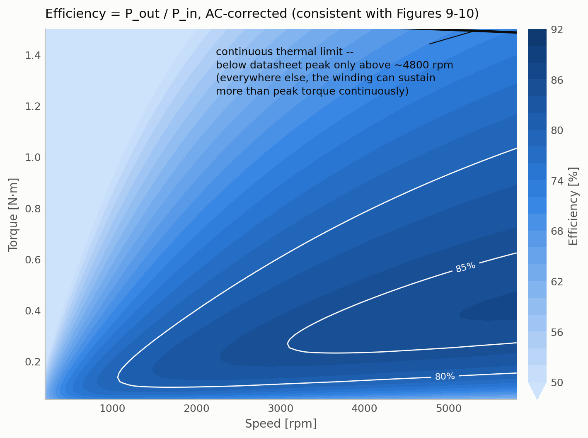

Today, I'll be showing all the sources of heat within a BLDC motor. We'll be using the ODrive D5065 motor as our model.

To start, there are 3 types of heat present in a motor at any time: iron losses, copper losses, and mechanical losses.

Starting with copper losses, you can have heat loss due to the motor demanding current from the electronic speed controller (ESC), which would represent DC current loss as described by $P = I^2 R$. Additionally, as a result of the motor requiring 3-phase power to work, we also have skin effect and proximity effect. The effects of which increase greatly at higher frequencies.

Core losses primarily occur within the stator. Heat is generated here by way of hysteresis loss, which is the heat generated from all the alternating magnetic waves present in a motor, and eddy current loss, which are small current loops created within the stator that create heat.

Lastly, mechanical heat is the easiest to imagine. The touchpoints between the stator, bearings, and shaft are all contact points that rub against one another with nonzero friction. As a result, no matter how precise the machining, there will be friction losses, especially at high speeds. Finally, windage is waste heat caused by air drag and turbulence as air moves within the motor.

Our final goal here is to simulate and graph all these individual sources of heat and see how they change as we adjust torque and RPM. By plotting the combined influence of power losses, and calculating power output as a function of torque and speed with $P = T\omega$ where $\omega = \text{RPM} \cdot 2\pi / 60$, we can determine input power as a function of torque and speed, $P_{in} = P_{out} + P_{loss}$.

Ultimately, the goal is to take input power and output power graphs to determine the efficiency of the motor when driven at a particular power and speed. This is helpful to visualize a particular motor's performance.

**Assumptions**

There are still some heats I'm not taking into consideration.

* Magnetic eddy currents are current loops that can occur within the permanent magnets on a stator. I'll be modeling this heat in another post but for now we'll assume its contribution is 0 across all parameters.
* PWM rippling - due to the rapid switching from the ESC, small fluctuations of current occur when fed into the motor. This results in ripple current copper loss, and ripple-flux core loss.
* Eddy current heating in the rotor itself
* Magnet thermal feedback loop - increase in magnet heat leads to decrease in field density, which leads to iron loss and torque constant loss. Therefore, copper losses for the same output torque rises.
* Bearing loss - we mentioned bearing loss but it was modeled as a constant. Real bearings have grease-viscosity temperature dependence.
* Drive electronics heat - the mosfets that compose the ESC are also sources of heat loss.

All these limitations will be tackled some day, but for now they will remain unacknowledged.

**Tools**

* FEMM - used to model geometry of motor and simulate core flux density, slot area, and mass
* pyFEMM - used to script FEMM
* Python - used to calculate heats and graphs

**Copper losses**

Copper losses are one of the more significant heat sources in a motor. This is because for each additional amp of current, the heat squares in magnitude. For a BLDC motor, this is a big issue because if you want to do anything useful you need high current to drive the motor hard. Motors are one of the more current-hungry electronic components out there. Copper losses can be modeled as $P_{cu} = 3 I^2 R$, for the copper loss in all 3 phases. To create the graph, we're going to simulate running the motor at a particular torque and speed, then determine the power loss.

As you can see, the graph is a bunch of horizontal stacks. The magnitude doesn't change as you vary speed, it stays constant. Torque on the other hand changes dramatically and scales from 0 to 210 W in losses. This is because torque depends on current to increase. You want more torque, you need a lot of current, and current increases heat losses by a square factor. Speed of rotation depends on voltage, which would not increase copper losses at DC.

Now let's consider AC copper effects.

AC copper losses can be thought of as the decrease of effective conduction area in a wire as frequency/RPM increases. This area decrease is due to skin and proximity effects. Skin effect is a result of self-induced eddy currents within a wire's own body that go against the actual DC current. It directly opposes real current flow in the center so much so that the actual conducting area of the wire becomes shaped like an annulus.

As you can see, the area is much smaller than before. Resistance of a wire is proportional to its area, by decreasing area, you decrease resistance, thus increasing losses since current would be held constant. A current in a smaller area will produce more heat than that same current in a larger area. The rate at which this area decreases can be calculated with skin depth, where $\delta = \sqrt{\rho / (\pi f \mu_0)}$ — the depth over which current density decays by $1/e$ due to the conductor's own AC field pushing current toward its surface.

Proximity effect is essentially the same phenomenon but from another wire instead. Induced eddy currents from neighboring coils oppose real current flow. Depending on the orientation of this external wire, the area can skew and shrink towards the left or right edge of the wire. The point is that the area shrinks anyways.

The impact of all this effective shrinkage is accounted for in computing the Dowell ratio $R_{ac}/R_{dc}$, a dimensionless number. This is what we measure changing in our graph this time, instead of pure watts.

Vertical bands make sense here, Dowell ratio depends on frequency/RPM. If the Dowell ratio goes up that means the AC resistance goes up. If you wanted to actually get AC resistance, you multiply the Dowell ratio by the DC resistance. However, the ratio is so close to unity that the product of the ratio with any DC resistance is basically equal to DC resistance still. In fact, AC resistance would only contribute a few percent of the total heat loss. It is nearly negligible.

**Core losses**

Hysteresis loss and eddy current loss compose core losses in the stator.

Hysteresis loss is the heat generated when you repeatedly magnetize and demagnetize a metal. This can be seen in a hysteresis loop.

As you increase magnetizing force (x-axis), the field density increases (y-axis). Once you reach the corner, you've reached saturation. If you follow the path of the graph counterclockwise, you can see that our magnetizing force has decreased to 0 but its flux density (B) is still high. To bring the magnet back to its original unpowered state, you have to reverse your magnetizing force in the opposite direction so that $B = 0T$ once again. The cost of doing this exerts heat because moving magnetic domains within a magnet to align and realign repeatedly causes a lot of magnetic friction. Faster switching of magnets equals more loss in the core. So hysteresis loss increases with speed as seen in $P_{hyst} = k_h \cdot f \cdot B_{pk}^{\alpha}$.

Eddy current losses in the stator are the reason stators are manufactured with thin silicon steel sheets with a varnish coating. Eddy currents are produced inside the stator that get stronger with frequency. By building stators in sheets, eddy currents are split into smaller components. Since power loss scales by a square factor with current, decrease in current is greatly appreciated, as seen in $P_{eddy} = k_e \cdot f^2 \cdot B_{pk}^2$.

**Mechanical loss**

Windage is the aerodynamic drag acting on the spinning rotor. This loss is very miniscule and only increases at top speeds. The relationship to speed is quadratic as seen in $P_{windage} = k_{windage} \cdot \omega^2$.

Bearing friction is modeled as a constant 0.2W. Friction dominates mechanical loss. Within 0.2W is preload, static, and speed-dependent friction.

**Total power analysis and motor efficiency**

Let's add up all the losses in power we have found.

Graph makes a lot of sense, power loss is attributed to torque in many cases. However, some losses don't depend on speed much.

Now, let's get the power output by multiplying torque and angular speed.

Input power is then given by $P_{in} = P_{out} + P_{loss}$, so just sum the graphs.

So we have the input power, we have the output power. Efficiency is simply the measure of the ratio between those two quantities. $\eta = P_{out}/P_{in} = \tau\omega/VI$. $\tau\omega$ are the output metrics and $VI$ are the input metrics. Together we get this.

Looking at the graph our most efficient contour sits at ~85% at around 0.2 Nm, if you move to the right, you can drive your motor at higher rpm's without losing efficiency or increasing RPM. If you travel up instead, you are able to increase your torque by ~0.2 Nm for no sacrifice in efficiency either. The crossover point is something you implicitly optimize for.

**Conclusion**

Taking a look at the legends for all these graphs, we can see that copper losses are the majority of heat, followed by iron and mechanical. The other sources of heat we assumed to be zero are also very insignificant compared to copper losses. Taken from the graphs, we have a table of values as torque varies.

| Torque [N·m] | $P_{cu}$ [W] | $P_{fe}$ [W] | $P_{mech}$ [W] | Total [W] | Cu % | Fe % | Mech % |
|-------------:|-------------:|-------------:|---------------:|----------:|-----:|-----:|-------:|
| 0.1          | 1.3          | 4.55         | 0.20           | 6.05      | 21.5% | 75.2% | 3.3% |
| 0.2          | 5.2          | 4.55         | 0.20           | 9.95      | 52.3% | 45.7% | 2.0% |
| 0.4          | 22.6         | 4.55         | 0.20           | 27.35     | 82.6% | 16.6% | 0.7% |
| 0.6          | 60.8         | 4.55         | 0.20           | 65.55     | 92.8% | 6.9%  | 0.3% |

Core and mechanical loss stay essentially fixed as torque increases (they track speed, not torque), so copper loss goes from a fifth of total heat at light load to over 90% of it near peak torque.The crossover is what makes copper the loss to optimize for once you push beyond light-duty operation. 

Another table from our graphs, we vary speed here instead and hold torque constant at 0.3 N·m.

| Speed [rpm] | $P_{cu}$ [W] | $P_{fe}$ [W] | $P_{mech}$ [W] | Winding temp [°C] | Efficiency |
|------------:|-------------:|-------------:|----------------:|------------------:|-----------:|
| 200         | 9.21         | 0.25         | 0.20            | 27.8               | 39.4%      |
| 1500        | 9.23         | 2.66         | 0.20            | 28.5               | 79.6%      |
| 3240        | 9.29         | 8.03         | 0.20            | 30.1               | 85.3%      |
| 4800        | 9.36         | 14.94        | 0.20            | 32.1               | 86.0%      |
| 6480        | 9.46         | 24.58        | 0.20            | 34.9               | 85.6%      |

Copper loss barely moves with speed at fixed torque (the small rise from 9.21 W to 9.46 W is the AC/Dowell penalty, not the DC term) — core loss is what climbs, from negligible to over 2.5x the copper loss by top speed. Efficiency rises fast as output power ramps up, peaks around 4800 RPM, then edges back down as core loss growth outpaces the gain in output power.

There's a myriad of techniques to minimize copper losses:

* Special stacking methods when winding stator
* Use square wires to improve winding factor and minimize air gaps
* Litz wiring - braided wire

Some more ways to decrease other heat and increase efficiency:

* Skewing magnets for smoother rotation
* Splitting magnets in half and skewing
* Backplate to concentrate magnetic fields inside motor
* Better magnets like N52
* Use FOC control for smoother torque
* PWM tuning to reduce current rippling
* Decreasing silicon concentration in steel for higher saturation limits in stator
* Increasing silicon concentration for lower core loss

You can check out my scripts and figures at my [Github](https://github.com/JimmerLitter/Motor-Loss-Study)